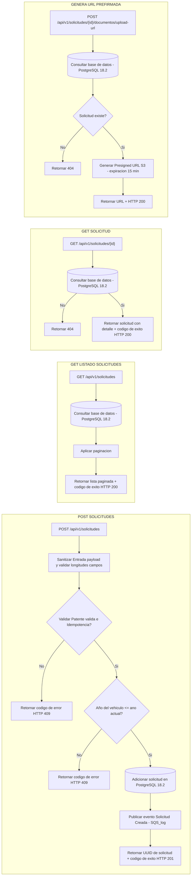
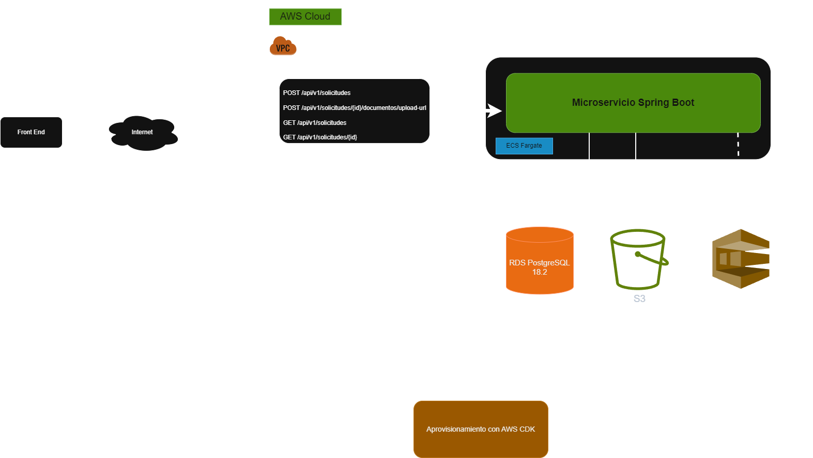

# Plataforma de Gestión de Flotas

Se requiere implementar un microservicio que reciba las solicitudes de inscripción de vehículos provenientes del frontend, las valide, las persista y notifique el evento para su procesamiento asíncrono.

El objetivo es evaluar tu dominio de Java (Spring Boot 3), diseño de APIs RESTful, y tu capacidad para definir infraestructura como código
utilizando AWS CDK.

## Requisitos Funcionales

Implementar un servicio que exponga los siguientes endpoints:

* POST /api/v1/solicitudes: Recibe un JSON con los datos del propietario y vehículo (mismos campos que el frontend).

    * Validaciones de Negocio:
        
        * La patente debe tener el formato correcto.
        * El año del vehículo no puede ser futuro.
        * No se pueden inscribir vehículos con patentes ya registradas (simular chequeo).
        * Respuesta: Retorna un ID único de solicitud (UUID) y código HTTP 201.


* GET /api/v1/solicitudes: Retorna el listado de solicitudes registradas.

  * Paginación: Debe soportar paginación (ej: ?page=0&size=10 o NextToken si usas DynamoDB).

* GET /api/v1/solicitudes/{id}: Retorna el estado y detalle de la solicitud.

* POST /api/v1/solicitudes/{id}/documentos/upload-url:

    * Genera y retorna una URL Prefirmada (Presigned URL) de S3 para permitir la carga directa del archivo desde el frontend, sin pasar el binario por el backend.

## Justificación del enfoque API

Aunque el proyecto se fundamenta en un enfoque API-First, no se implementaron mocks ni se utilizaron herramientas API-First (OpenAPI,Stoplight, etc ), debido  a que el documento  definía los endpoints, los contratos y las validaciones requeridas. De igual forma, no se requiere integracion con el front end.

## Diagrama de Flujo de Proceso


## Diagrama Arquitectonico



## Decisión Persistencia

Para la selección del motor me base en los siguientes requisitos funcionales y no funcionales que afectaron mi decisión

### Requisitos Funcionales

* "No se pueden inscribir vehículos con patentes ya registradas". Si falla afecta la confiabilidad e integridad del sistema

### Requisitos No Funcionales

 * Robustez: "El servicio debe resistir entradas maliciosas o errores de concurrencia .. "
 * Idempotencia: "Si el cliente envía la misma solicitud dos veces simultáneamente (ej: doble click)"

Nota: Es importante anotar que el documento no refleja el nivel de concurrencia y volumen transaccional

### Justificación Persistencia

Se decidio escoger PostgreSQL por las siguientes razones:

* PostgreSQL soporta transacciones ACIS permitiendo garantizar de forma sencilla y segura que no se inscriban vehículos con patentes ya registradas mediante constraint UNIQUE O PK (UNIQUE + NULL). De igual forma para la concurrencia, la base de datos garantiza que solo una transaccion sera exitosa y esto  hace mas facil la idempotencia. Para Dynamo  es mas complejo el compotamiento anterior porque debo usar ConditioExpression o TransactWriteItems y es un poco mas dificil. Punto a favor de PostgreSQL.

* La integración de PostgreSQL con SpringBoot es mas natural usando Spring Data JPA y la gestión de transacciones. Dynamo puede que requiera un mayor nivel de configuracion. Punto a favor de PostgreSQL. 

* PostgreSQL soporta consultas más complejas y Joins. Aunque el modelo de datos para este ejemplo es pequeño,  esto puede favorecer mucho la extraccion de información. Punto a favor de PostgreSQL

* El escalamiento horizontal para PostgreSQL es mas complejo comparado con DynamoDB y ofrece escalabilidad automática y modelo serverless. Punto a favor de DynamoDB. Sin embargo, dado que el documento no especifica alta concurrencia ni alto volumen transaccional, este factor no es determinante para la decision 


## Robustez y Protección (Bullet-Proof Design)

La solución, segun lo solicitado, implementa las siguientes medidas para garantizar resistencia ante errores, concurrencia y entradas maliciosas 

### Idempotencia y Concurrencia

1. Se implementó un UNIQUE constraint sobre el campo patente en la base de datos para garantizar idempotencia
2. En caso de solicitudes simultáneas (doble click), PostgreSQL garantiza que solo una transacción será exitosa.
3. Se captura DataIntegrityViolationException y se retorna HTTP 409 (Conflict).
4. Validación previa en la capa de servicio para evitar operaciones innecesarias, optimización para evitar operaciones innecesarias sobre BD. La protección real contra registros duplicados se garantiza mediante el UNIQUE constraint, ante solicitudes simultáneas.

### Sanitización

1. Todos los campos String se normalizan usando trim().
2. Se validan longitudes máximas con anotaciones @Size.
3. Se valida el formato de la patente mediante expresión regular utilizando la anotación @Pattern(^[A-Z]{3}[0-9]{4}$) de Bean Validation en el DTO.
4. Se valida que el año no sea futuro en la capa de servicios

### Manejo de Errores

1. Implementación de GlobalExceptionHandler.
2. No se exponen stack traces al cliente.
3. Respuestas estandarizadas de error con códigos HTTP adecuados (400, 404, 409, 500).

## Calidad Backend:

### Arquitectura limpia (Controller, Service, Repository), Manejo de Excepciones (GlobalExceptionHandler) y uso de DTO

1. Controller: Expone los endpoints REST y maneja la interacción HTTP.
2. Service: Contiene la lógica de negocio y algunas validaciones adicionales 
3. Repository: Encapsula el acceso a datos mediante Spring Data JPA.
4. Domain: Entidades JPA que representan el modelo persistente en la base de datos.
5. DTOs: Objetos de transferencia de datos 
6. Mapper: Conversión entre entidades y DTOs.
7. Exception: Excepciones  personalizadas e incluyento el GlobalExceptionHandler
8. Event: Publicación del evento de dominio para publicar en una SQS en AWS.

### Tests Unitarios

Se crearon los Test unitarios con JUnit y mockito para

1. Creación exitosa de solicitud.
2. Retorno de solicitud existente.
3. Retorno de solicitud existente.
3. Paginación de resultados.

## Calidad Infraestructura (CDK)

### Estructura del Proyecto CDK

La infraestructura se encuentra en la carpeta /infra, separada del backend, garantizando independencia entre aplicación e infraestructura.

### Uso Correcto de Constructs

Se utilizaron constructsdefinir los recursos:

1. Vpc para la red privada.
2. DatabaseInstance para PostgreSQL.
3. Cluster, FargateTaskDefinition y FargateService para ECS.
4. Bucket para almacenamiento de documentos.
5. Queue para mensajería asíncrona.

### Principio de Mínimo Privilegio (IAM)

1. El contenedor solo tiene permiso de escritura (PutObject) sobre el bucket S3 específico.
2. Solo puede enviar mensajes (SendMessage) a la cola SQS definida.
3. No se otorgaron permisos globales ni accesos innecesarios

## Ejecutar Microservicio de Forma Local

### Requisitos

* Requisitos
* Java 17
* Maven 3.9+
* Docker
* AWS CLI configurado

### Pasos para ejecutar

1. Clonar el Servicio
2. Levantar base de datos. Acceda a la Root Path del proyecto a la carpeta deploy y ejecutar
    ```
    docker-compose up -d
    ```
3. Compilar proyecto
    ```
    mvn clean install
    ```
4. Ejecutar aplicación
    ```
    mvn spring-boot:run
    ```

#### La API estará disponible en:
    http://localhost:8080
    
#### Swagger:
    http://localhost:8080/swagger-ui.html
 
 #### Colecciones Postman
  Puede encontrar la colección de Postman para probar el servicio en la carpeta: Colecciones

## Payload Peticion Crear Solicitud

```json

    {
        "nombre_propietario": "Juan Perez",
        "correo_electronico_propietario": "juan.perez@email.com",
        "patente": "ABC1234",
        "anualidad_vehiculo": 2017,
        "marca_vehiculo": "Chevrolet",
        "modelo_vehiculo": "Spark GT",
        "tipo_vehiculo": "Sedan"
    }

```

## Stack Tecnologico

*   Spring Boot 3.2
*   Java 17
*   PostgreSQL 16
*   Mermaid
*   Docker
*   CDK en Java
*   SQS
*   S3

